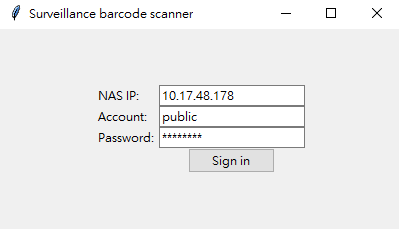
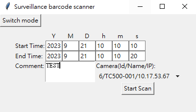
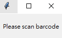
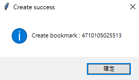
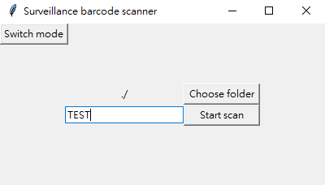
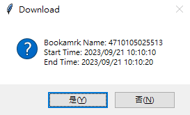

# barecode-windows-app

## Description

Bookmark is one of the surveillance feature that providing a convenient way to  record and download the specific time periods of surveillance video. And this is a surveillance API integration sample that demonstrates a desktop application that utilizes a barcode scanner and surveillance API for surveillance bookmark creating and downloading functionality.

## Setup environment

This sample is a python project built with python 3.11 and typically could run with all versions of python 3. [Requests](https://requests.readthedocs.io/en/latest/) and [Tkinter](https://docs.python.org/3/library/tkinter.html) are used in the sample. If you haven't installed "requests", please install it with the command below.

```bash
pip install requests
```

And "tkinter" is a default module of python, so you can use it without any additional installed.

## Demo

### 1. Sign In



To access surveillance station, SID is the necessary key. In this sign in window, the [Sign In API](https://surveillance-api.synology.com/#get-/webapi/SurveillanceStation/ThirdParty/Auth/Login/v1) is used to retrieve the sid with the NAS address, account and password.

### 2. Create bookmark with barcode



Upon successful login, you will be directed to the bookmark creation page. On this page, you can [select the camera](https://surveillance-api.synology.com/#get-/webapi/SurveillanceStation/ThirdParty/Camera/List/v1), input the bookmark's start and end time, and add comments to the bookmark. After filling in the required information, pressing the "Start Scan" button allows you to start using the barcode scanner to scan the barcode. If there are no barcode scanner beside you, type with keyboard and press "Enter" after finished also works.



After successfully scanning and [creating a bookmark](https://surveillance-api.synology.com/#get-/webapi/SurveillanceStation/ThirdParty/Bookmark/Create/v1), a message window will pop up to inform you of the bookmark has been successful creation. And the barcode and bookmarks information will be stored. By the way, the barcode will also be the bookmark name.



### 3. Download video with barcode



After creating the bookmarks, you can use barcode to download the corresponding bookmark video. Pressing the "Switch mode" button and you will change to download mode. After filling in file name and pressing the "Choose folder" button to choose  the direction, pressing the "Start scan" button to scan the barcode.



If the barcode is created, the message window will pop up to ask whether you want to [download the video](https://surveillance-api.synology.com/#get-/webapi/SurveillanceStation/ThirdParty/Bookmark/DownloadRecording/v1).
