# Analyze Live Stream from Synology Surveillance Station
Do you want to integrate a fall detection model and trigger an alarm or notification to save a life? Or managing the parking space by integrate license plate recognition? We'll demonstrates how to get the camera's live stream and analyze it with your own model. Here, we develop a fall detection model as an example.

Whenever the system detects a fall event, it will trigger Action Rule to record the snippet of the event and send notification to users.

In this example, you will learn:
1. Get and analyze rtsp live stream from IP Camera
2. Setup Action Rule to send notification and record a event snippet when the event happens
3. Create new label category in Recording and add label to a specific recording

<p align="center">
    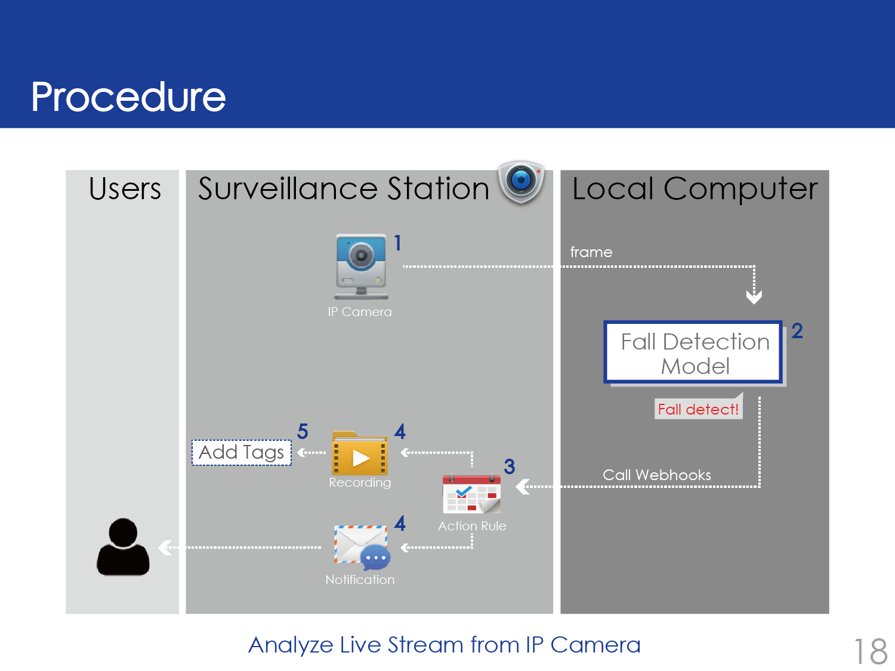</a>
</p>

## TensorFlow-2.x-YOLOv3
We use [TensorFlow-2.x-YOLOv3](https://github.com/pythonlessons/TensorFlow-2.x-YOLOv3) for objection detection and tracking. Please follow the Installation Guide in the repo to install the required dependencies.

For this project, you will only need to download the yolov3 pretrained weights into `../TensorFlow-2.x-YOLOv3/model_data`.

## Setup
### Add IP Camera
If you haven't add your IP camera, please follow the  [official guide](https://www.synology.com/en-global/knowledgebase/Surveillance/help/SurveillanceStation/ip_camera#add) to add your IP camera to Surveillance Station.

### Get and analyze rtsp live stream from IP Camera
After adding your camera, you can refer to the Sample code to get and analyze rtsp live stream from IP Camera.

### Enable Notification
Open Notification app in the Surveillance Station, click Push Service, change the setting as the image below and remember to fill in your own email.
<p align="center">
    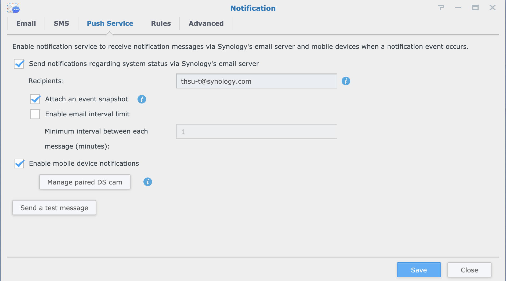</a>
</p>

Click Rules and check the boxes of Email, SMS and Mobile for Action Rule.
<p align="center">
    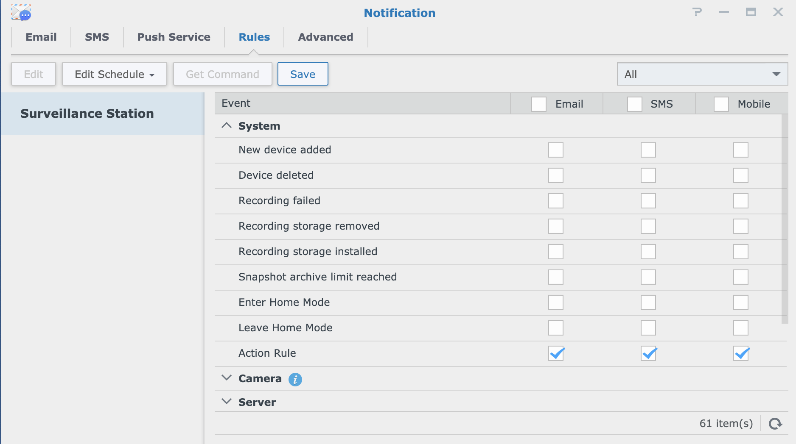</a>
</p>

Open Action Rule App in the Surveillance Station. Now click button "add" to add a new rule to trigger notification.
<p align="center">
    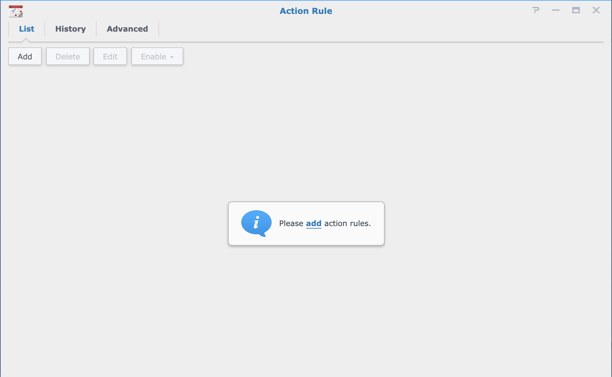</a>
</p>

Name rule and select the setting as image below.
<p align="center">
    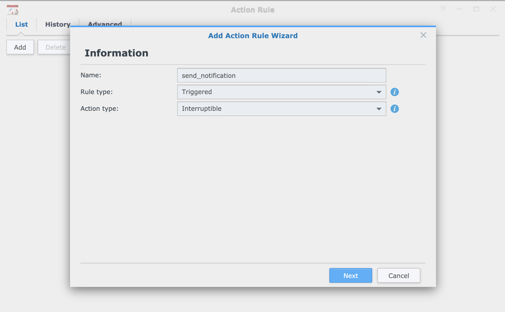</a>
</p>

Select Webhook as event source, and you will get a Webhook URL. Please copy the token to send_notification method in `../webAPI.py`.
<p align="center">
    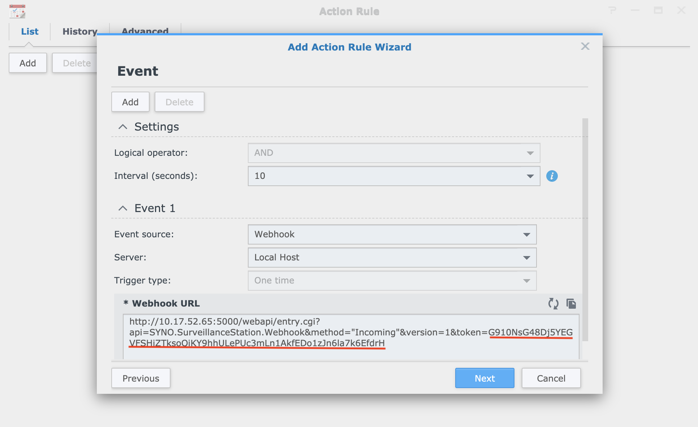</a>
</p>

Next, set Action to Send Notification and Enbable Attach an event snapshot if you wish, and click next.
<p align="center">
    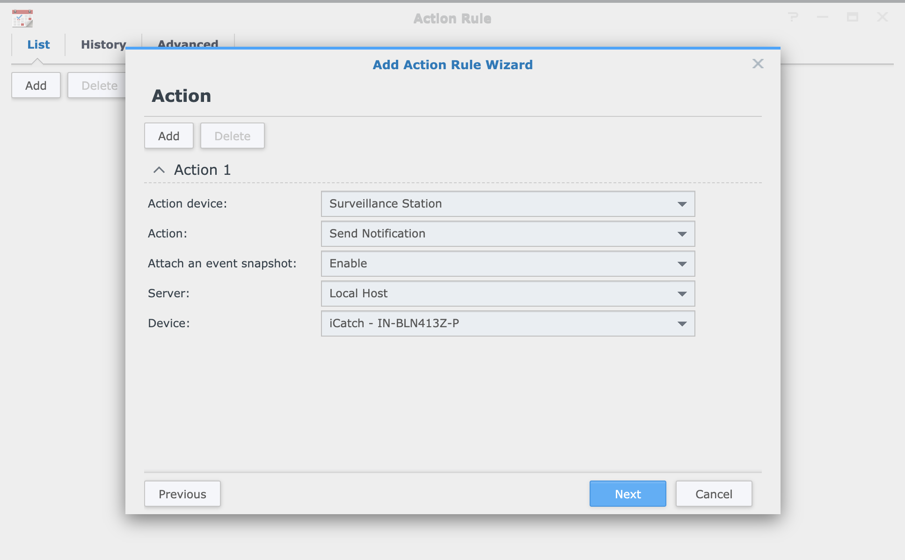</a>
</p>

When you finish, you will see a rule show up in your list.
<p align="center">
    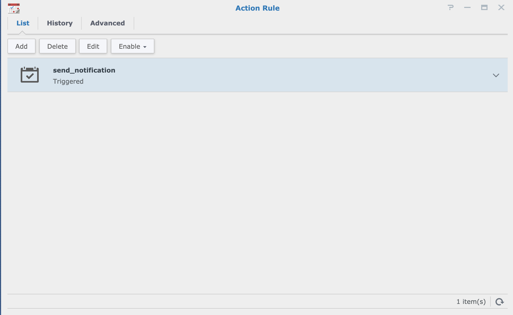</a>
</p>

### Record and Tag for Fall Event
To record a fall event snippet when it happens, you need to add another action rule. Name this rule and select the setting as image below.
<p align="center">
    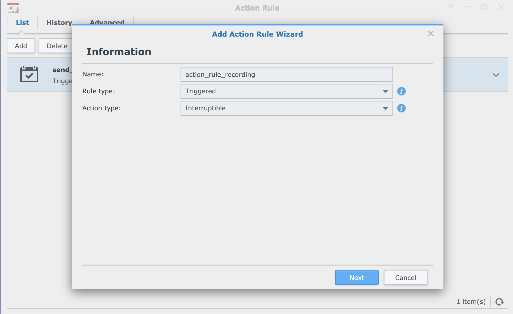</a>
</p>

Select Webhook as event source, and you will get a Webhook URL. Please copy the token to start_action_rule_recording method in `../webAPI.py`.
<p align="center">
    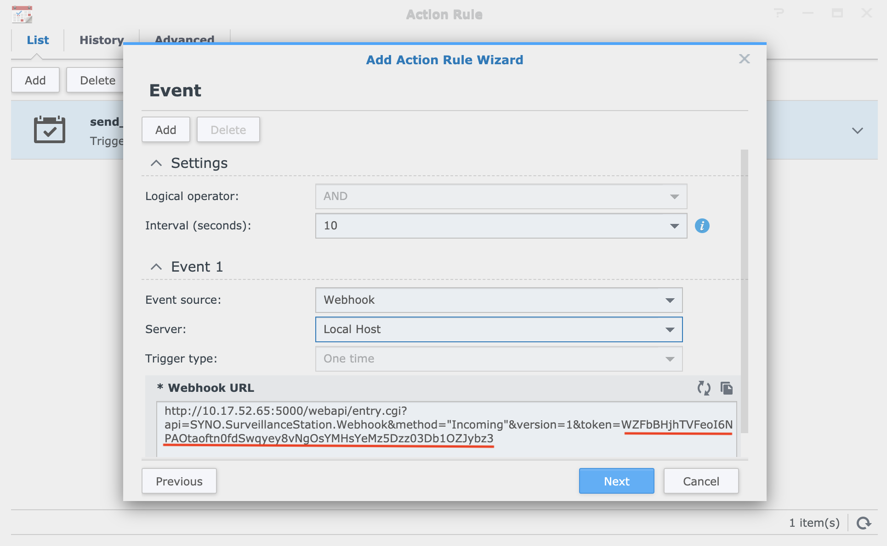</a>
</p>

Next, set the setting as image below, remember to choose the Device(camera) you want to use. Click next and finish, then the rule will show up in the Action Rule list.
<p align="center">
    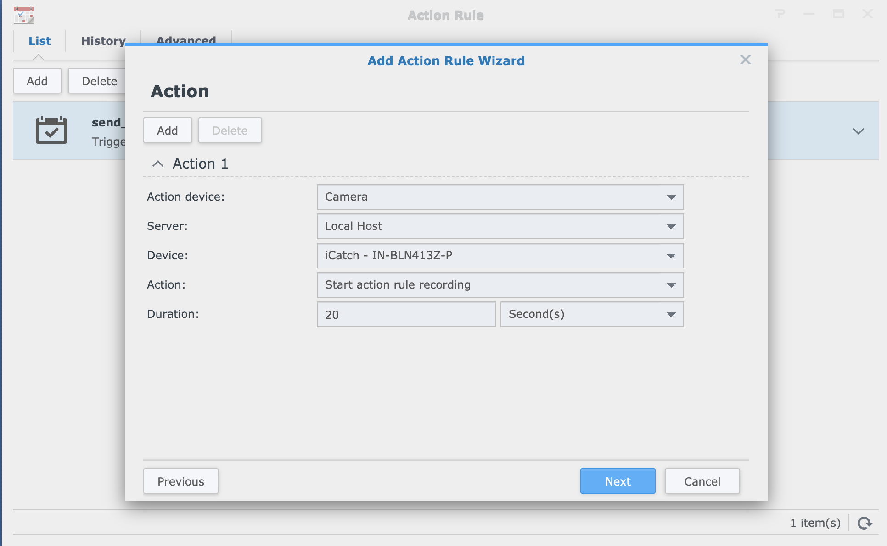</a>
</p>

(Optional) If you want to change pre/post-recording time before/after an event. Go to IP Camera, right click to edit your camera. Click Recording Settings and you can change the setting here.
<p align="center">
    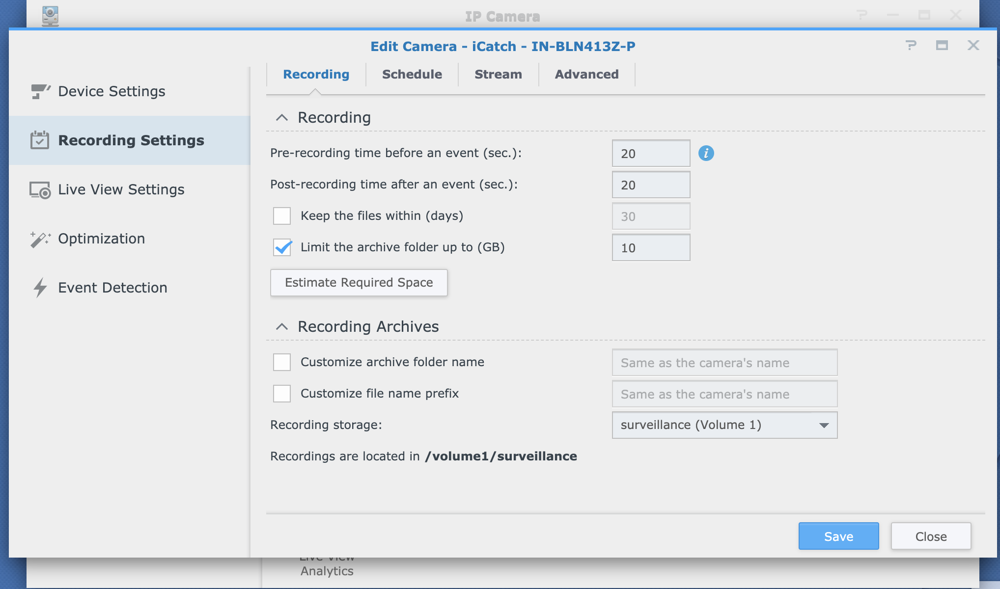</a>
</p>

## Run the demo
Edit `../fall_detection.py` to put your NVR IP_ADDR, PORT, ACCOUNT, PASSWORD.
Then, run the following command:
```
python fall_detection.py
```

## Results
If you run this demo successfully, you will see the notification in your email when a fall event happens, as well as event snippet in Recording
<p align="center">
    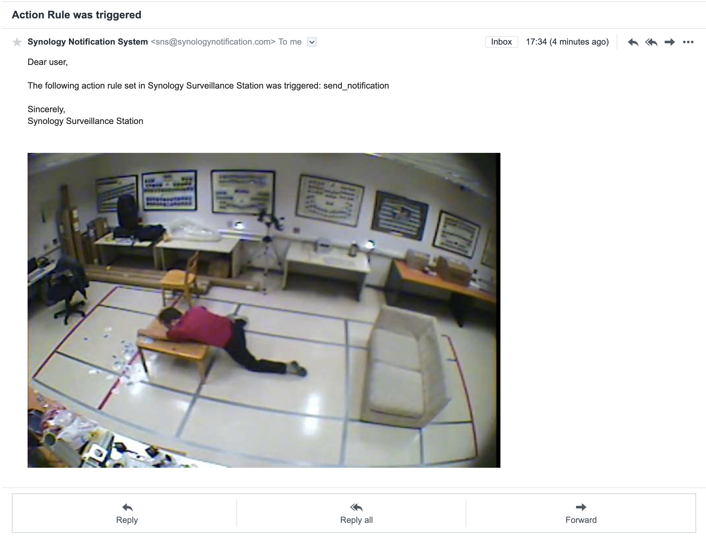</a>
</p>

<p align="center">
    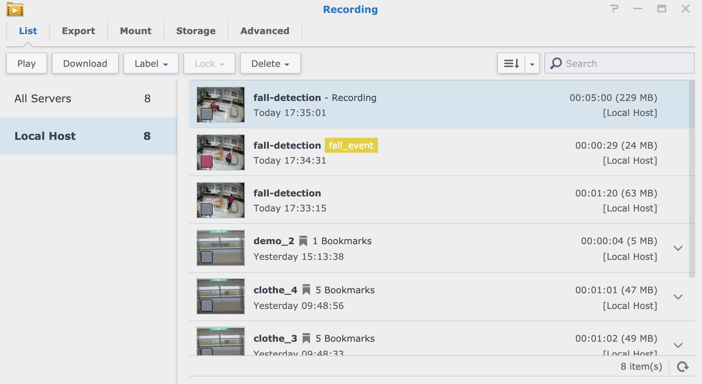</a>
</p>
