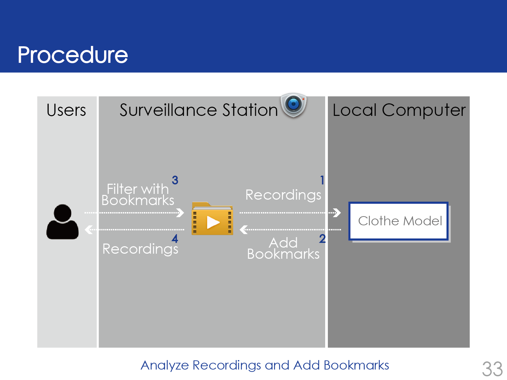
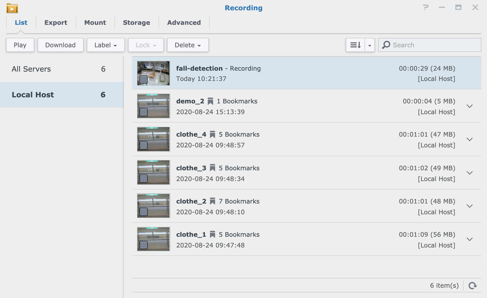
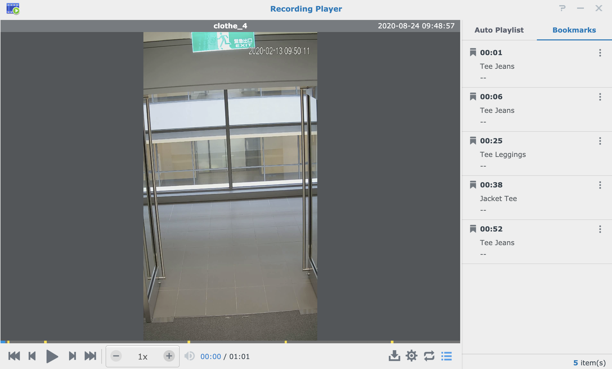
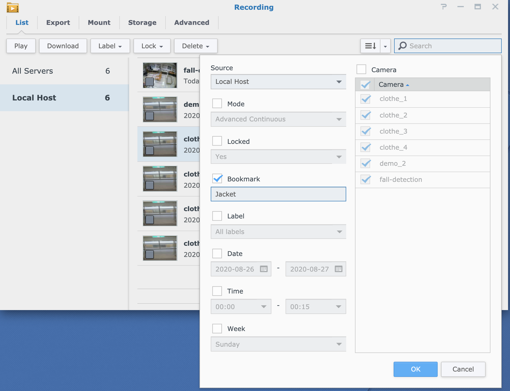

# Analyze Existing Recordings and Add Bookmarks
Hope to anaylze the recording to find out when is someone loitering near your door and record the time? Or finding out the hit color of the clothes that people is wearing to decide the business? Furthermore, add bookmarks to record the time when events happened. If so, this sample is what you need! This repository demonstrates how to analyze existing recordings with your own model and add bookmarks. We develop a clothe model as an example.

The system first downloads recordings on Surveillance Station to the local computer.
Then, it tracks all the people in the recordings, recognizes their wearings, and adds their wearings as bookmarks back to the recordings.
Finally, users can use these bookmarks as a filter to search related recordings.
In this example, you will learn:
1. Download and analyze existing recordings from Surveillance Station
2. How to add bookmarks to recordings.

<p align="center">
    </a>
</p>

For the detail of Clothe Model, please refer to clothe-model.pdf in this directory.

## TensorFlow-2.x-YOLOv3
We use [TensorFlow-2.x-YOLOv3](https://github.com/pythonlessons/TensorFlow-2.x-YOLOv3) for objection detection and tracking. Please follow the Installation Guide in the repo to install the required dependencies.

For this project, you will only need to download the yolov3 pretrained weights into `../TensorFlow-2.x-YOLOv3/model_data`.

## MMFashion
We use [MMFashion](https://github.com/open-mmlab/mmfashion) for clothe category classifying. Please install the required dependencies in this repo.

For this project, please download the following weights from [Model Zoo](https://github.com/open-mmlab/mmfashion/blob/master/docs/MODEL_ZOO.md) in MMFashion:
1. Download vgg16.pth in the Init models to `../mmfashion/checkpoint`
2. Download the VGG-16 Global Pooling model to `../mmfashion/checkpoint/CateAttrPredict/vgg/global`

You also need to download the following files from [Data Preparation](https://github.com/open-mmlab/mmfashion/blob/master/docs/DATA_PREPARATION.md) in MMFashion:
  * Download list_attr_cloth.txt and list_category_cloth.txt to `../mmfashion/data/Attr_Predict/Anno_fine`

## Download and analyze existing recordings from Surveillance Station
After preparing the environment, you can refer to the Sample code to download and analyze existing recordings from Surveillance Station.

## Run the demo
Edit `../add_recording_bookmark.py` to put your NVR IP_ADDR, PORT, ACCOUNT, PASSWORD. Then, run the following command:
```
python add_recording_bookmark.py
```

## Results
If you run this demo successfully, you will see the bookmarks when you open Recording.
<p align="center">
    </a>
</p>

If you click a specific recording, you can see all it's bookmarks on the right side.
<p align="center">
    </a>
</p>

You can also filter recordings with bookmarks.
<p align="center">
    </a>
</p>
