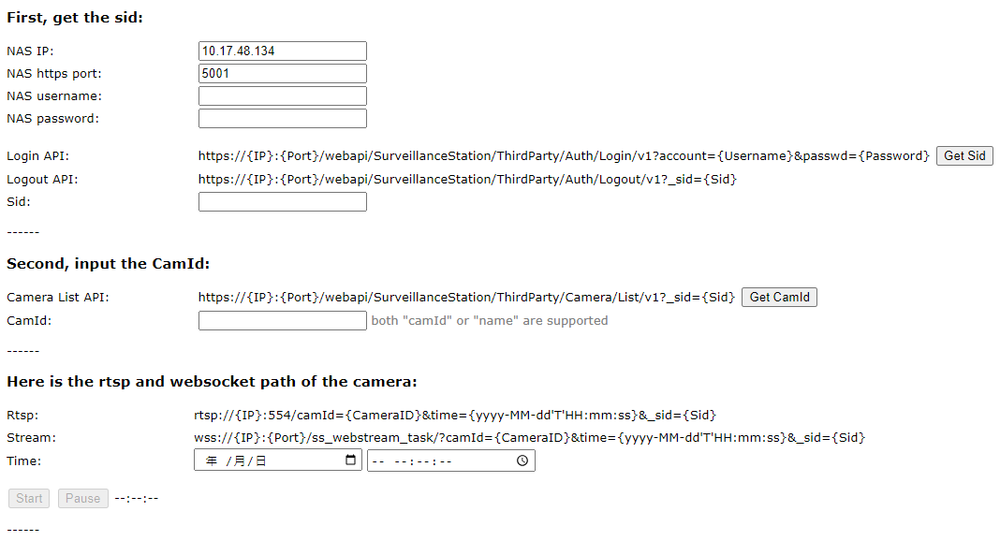

## Camera player

In this article, we will demonstrate how to play a camera stream in a browser using WebSocket and Media Source Extensions (MSE).
We will use SurveillanceStation, which sends video to the browser via WebSocket and MSE to play all video fragments.

We have created a WebSocket player class called WsPlayer (js/ws-player.js), which provides the following methods:

1. **play**: Plays video from the WebSocket URL.
2. **stop**: Stops the WebSocket connection and cleans up MSE.
3. **pause**: Pauses the stream.
4. **resume**: Resumes the stream.
5. **seek**: Plays back recording files and goes back to live view if the seek time is not a positive integer.
6. **setVolume**: Changes the audio DOM volume between 0 and 1.

The URL of the WebSocket is `wss://{Ip}:{Port}/ss_webstream_task/?camId={CameraID}&time={yyyy-MM-dd'T'HH:mm:ss}&_sid={Sid}`.

Follow the steps below to fill all WebSocket URL parameters:

1. Login by using the Web API to get the Sid: `https://{Ip}:{Port}/webapi/SurveillanceStation/ThirdParty/Auth/Login/v1?account={Username}&passwd={Password}`
2. Use the Camera List Web API to get the camera name as the CameraID: `https://{Ip}:{Port}/webapi/SurveillanceStation/ThirdParty/Camera/List/v1?_sid={Sid}`
3. Use local time, Linux timestamp, or ISO8601 format as the time to play back (e.g., time=2023-05-09T19:07:00).

The index.html file is a UI example.
First, fill in all the NAS IP, port, username, and password inputs, and then click the "Get Sid" button to send the Web API to generate the WebSocket URL.
Finally, fill in the camera name in CamId, and click the start button to play the camera stream.

    </a>

If the Sid is not used, clear it with the logout Web API: `https://{Ip}:{Port}/webapi/SurveillanceStation/ThirdParty/Auth/Logout/v1?_sid={Sid}`.

To extend the Sid's lifetime during playing in case of WebSocket error retry, use the KeepAlive Web API: `https://{Ip}:{Port}/webapi/SurveillanceStation/Recording/Keepalive/v5?_sid={Sid}`.

In this example, all the paths for web API and WebSocket are implemented via HTTPS. However, you are welcome to modify the path to HTTP if it suits your requirements.
